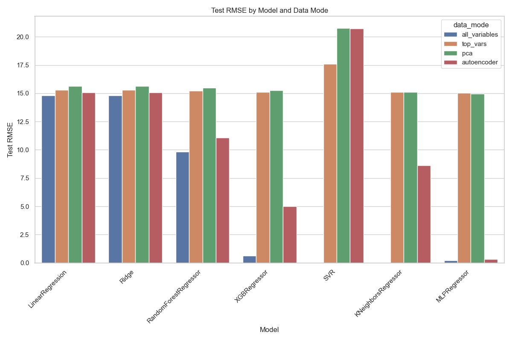
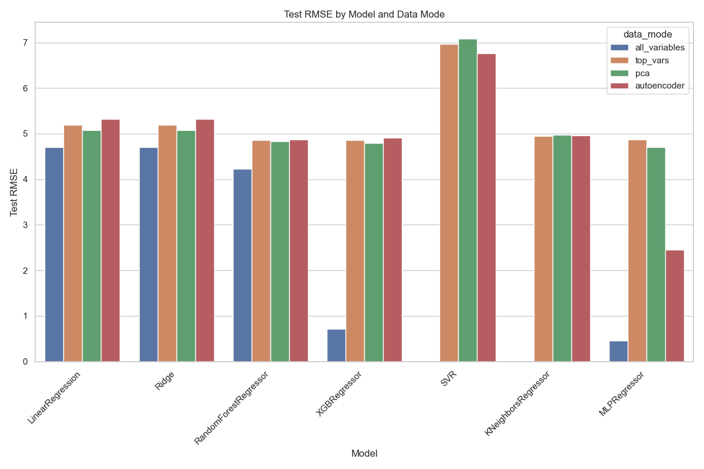
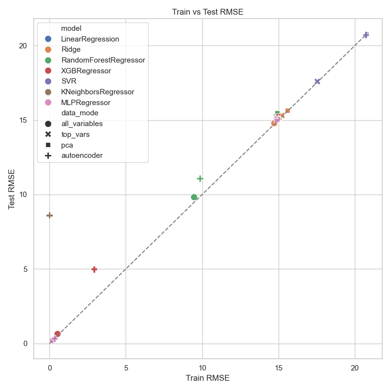
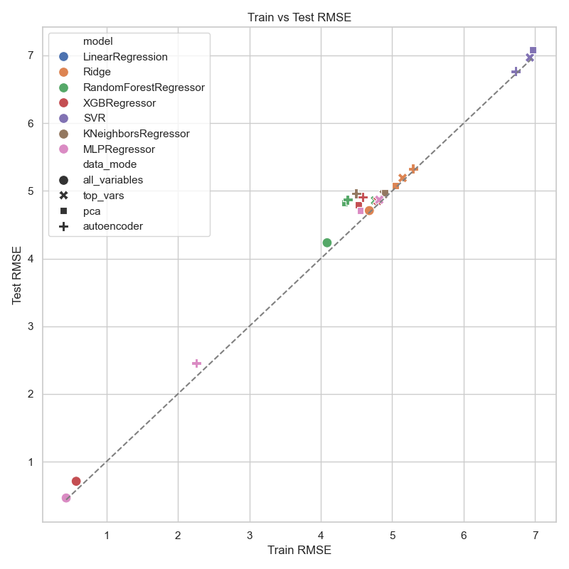
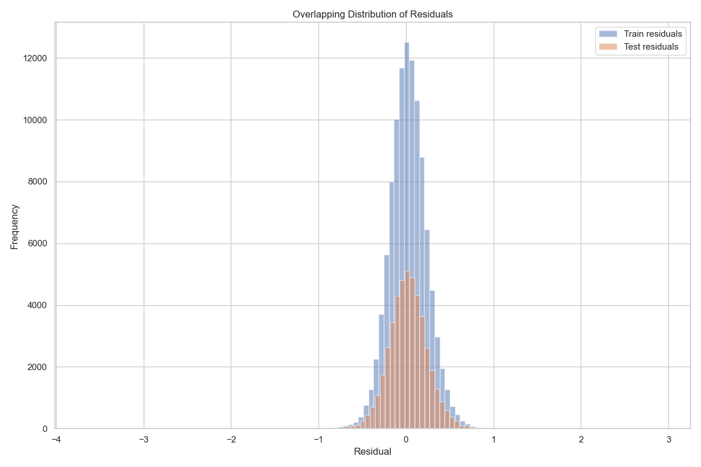
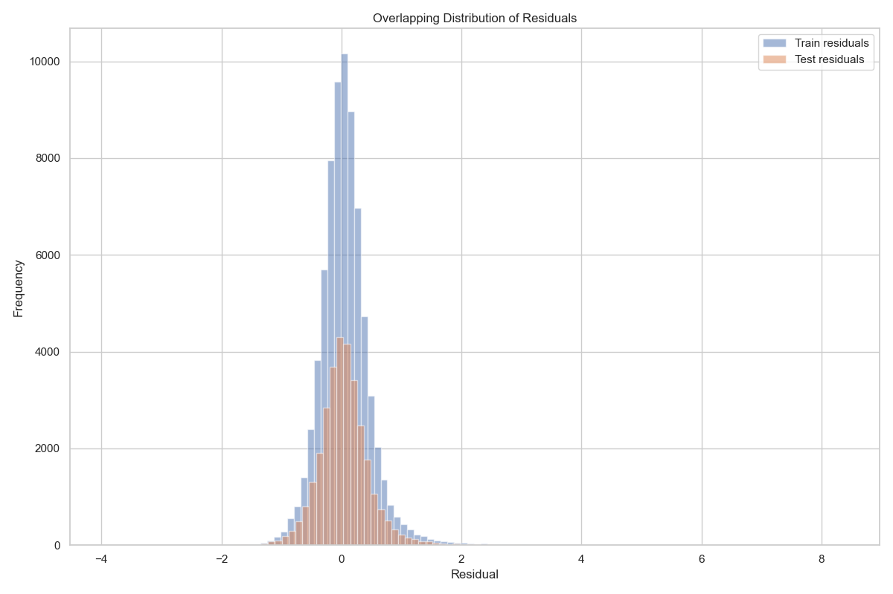

# End-to-End Machine Learning Pipeline for Options Pricing

_Author: Reza Arabpour_

---

## Quick Start

This section provides a rapid overview of how to set up and run the project from start to finish, what scripts to use, and what outputs to expect.

### Installation

1. **Clone the repository:**
   ```bash
   git clone https://github.com/arabporr/DSC.git
   cd DSC
   ```

2. **Create and activate a Python environment (recommended: Python 3.10):**
   ```bash
   python -m venv venv
   source venv/bin/activate  # On Windows: venv\Scripts\activate
   ```

3. **Upgrade pip and install all dependencies:**
   ```bash
   python -m pip install --upgrade pip
   pip install -r requirements.txt
   ```

   _Note: All required packages (including numpy, pandas, scikit-learn, matplotlib, torch, tensorflow, xgboost, etc.) are listed in `requirements.txt`._

### Running the Full Pipeline

To execute the entire workflow (data generation, preprocessing, model training, and evaluation) in one go, use:

```bash
python src/main.py European_Vanilla
# or
python src/main.py Worst_Off
```

This will:
- Generate synthetic data for the selected option type.
- Preprocess and split the data.
- Train all model families and select the best model.
- Evaluate and visualize results.

### Running Step-by-Step

Alternatively, you can run each step individually using the scripts in `src/scripts/`:

1. **Data Generation**
   ```bash
   python src/scripts/01_run_data_gen.py European_Vanilla
   # or
   python src/scripts/01_run_data_gen.py Worst_Off
   ```
   _Output: Raw data in `data/01_raw/`_

2. **Preprocessing & Feature Engineering**
   ```bash
   python src/scripts/02_run_preprocess.py European_Vanilla
   # or
   python src/scripts/02_run_preprocess.py Worst_Off
   ```
   _Output: Processed data in `data/02_processed/` and train/test splits in `data/03_splitted/`_

3. **Model Training**
   ```bash
   python src/scripts/03_run_training.py European_Vanilla
   # or
   python src/scripts/03_run_training.py Worst_Off
   ```
   _Output: Model results, logs, and best models in `results/<option_type>/`_

4. **Evaluation**
   ```bash
   python src/scripts/04_run_evaluation.py European_Vanilla
   # or
   python src/scripts/04_run_evaluation.py Worst_Off
   ```
   _Output: Evaluation plots and final model selection in `results/<option_type>/`_

### What to Expect as Outputs

- **Data files**: Raw, processed, and split datasets in the `data/` directory.
- **Results**: Model comparison tables, logs, best model pickles, and diagnostic plots in the `results/<option_type>/` directory.
- **Plots**: Visualizations of model performance and residuals for both option types.

The pipeline is fully automated and modular, so you can run everything at once or step-by-step, and you will find all outputs organized by option type in the respective folders.

---

## Overview

This project is a modular, end-to-end pipeline for options pricing using both classical and machine learning models. It supports two types of financial derivatives: **European Vanilla Options** and **Worst-Off Options**. The pipeline covers data generation, preprocessing, feature engineering, model training (with multiple model families), and evaluation.

---

## Installation

1. **Clone the repository:**
   ```bash
   git clone https://github.com/arabporr/DSC.git
   cd DSC
   ```

2. **Create and activate a Python environment (recommended: Python 3.10):**
   ```bash
   python -m venv venv
   source venv/bin/activate  # On Windows: venv\Scripts\activate
   ```

3. **Upgrade pip and install all dependencies:**
   ```bash
   python -m pip install --upgrade pip
   pip install -r requirements.txt
   ```

---

## Project Structure

```
.
├── src/
│ ├── data/ # Data generation and option pricing logic
│ ├── features/ # Data cleaning, feature engineering, preprocessing
│ ├── models/ # Model training, utilities, and model families
│ ├── evaluation/ # Model evaluation and selection
│ ├── scripts/ # Orchestration scripts for each pipeline step
│ └── main.py # Main entry point for the full pipeline
├── data/ # Raw, processed, and split datasets
├── results/ # Model results, plots, and best models
├── requirements.txt # Python dependencies
├── setup.py # Python package setup
└── .env_setup.txt # Environment setup instructions
```

---

## Pipeline Flow

| Step            | Script/Module                      | Description                                | Output Location                           |
| --------------- | ---------------------------------- | ------------------------------------------ | ----------------------------------------- |
| Data Generation | `src/scripts/01_run_data_gen.py`   | Generate synthetic option pricing data     | `data/01_raw/`                            |
| Preprocessing   | `src/scripts/02_run_preprocess.py` | Clean, engineer features, split data       | `data/02_processed/`, `data/03_splitted/` |
| Model Training  | `src/scripts/03_run_training.py`   | Train multiple model families              | `results/<option_type>/`                  |
| Evaluation      | `src/scripts/04_run_evaluation.py` | Evaluate models, select best, plot results | `results/<option_type>/`                  |
| Full Pipeline   | `src/main.py`                      | Run all steps in sequence                  | All above                                 |

---

## Step-by-Step Details

### 1. Data Generation
[Back to Pipeline Flow](#pipeline-flow)

**Script:** `src/scripts/01_run_data_gen.py`  
**Core Logic:** `src/data/generate.py`  
**Output:** `data/01_raw/European_Vanilla_dataset.csv`, `data/01_raw/Worst_Off_dataset.csv`

#### What it does
- Generates synthetic datasets for two option types:
  - **European Vanilla**: Uses Black-Scholes and Monte Carlo pricing.
  - **Worst-Off**: Uses Monte Carlo pricing for basket options.
- Parallelizes computation for efficiency.

#### Parameter Grid (with Default Values)

- **European Vanilla:**
  - `option_type`: ["call", "put"]
  - `S`: Underlying asset price (default: [80, 90, 100, 110, 120])
  - `K`: Strike price (default: [80, 90, 100, 110, 120])
  - `T`: Time to expiration in years (default: [0.25, 0.5, 1.0, 2.0])
  - `r`: Risk-free interest rate (default: [0.01, 0.05, 0.1])
  - `sigma`: Volatility (default: [0.1, 0.2, 0.3, 0.4])
  - `q`: Dividend yield (default: [0.0, 0.02])
  - `n_paths`: Number of Monte Carlo paths (default: 10,000)

- **Worst-Off:**
  - `option_type`: ["call", "put"]
  - `S1`, `S2`: Spot prices for two assets (default: [80, 90, 100, 110, 120])
  - `K1`, `K2`: Strike prices for two assets (default: [80, 90, 100, 110, 120])
  - `sigma1`, `sigma2`: Volatilities (default: [0.1, 0.2, 0.3, 0.4])
  - `q1`, `q2`: Dividend yields (default: [0.0, 0.02])
  - `corr`: Correlation between assets (default: [-0.5, 0.0, 0.5, 0.9])
  - `T`: Time to maturity in years (default: [0.25, 0.5, 1.0, 2.0])
  - `r`: Risk-free rate (default: [0.01, 0.05, 0.1])
  - `n_paths`: Number of Monte Carlo paths (default: 10,000)

**All parameter grids and their default values are defined in `src/data/generate.py` and can be customized.**

#### Data File Structure

- `data/01_raw/European_Vanilla_dataset.csv`
- `data/01_raw/Worst_Off_dataset.csv`

Each row is a unique parameter combination with computed option prices.

---

### 2. Preprocessing & Feature Engineering
[Back to Pipeline Flow](#pipeline-flow)

**Script:** `src/scripts/02_run_preprocess.py`  
**Core Logic:** `src/features/preprocess.py`, `src/features/European_Vanilla.py`, `src/features/Worst_Off.py`  
**Output:**  
- Processed: `data/02_processed/European_Vanilla_processed_dataset.csv`, `data/02_processed/Worst_Off_processed_dataset.csv`
- Splits: `data/03_splitted/<option_type>/training_data.csv`, `data/03_splitted/<option_type>/testing_data.csv`

#### What it does
- Cleans raw data (removes outliers, handles missing values, etc.)
- Feature engineering:
  - For **European Vanilla**: Adds features like moneyness, time decay, etc.
  - For **Worst-Off**: Adds basket-specific features, correlation effects, etc.
- Splits data into train/test (70/30 by default).

#### Feature Engineering Details

- **European Vanilla**:
  - Feature engineering in `src/features/European_Vanilla.py`
  - Typical features: moneyness, log-moneyness, implied volatility, etc.

- **Worst-Off**:
  - Feature engineering in `src/features/Worst_Off.py`
  - Typical features: asset ratios, basket statistics, correlation features, etc.

#### Data File Structure

- `data/02_processed/`: Cleaned and feature-engineered datasets
- `data/03_splitted/<option_type>/`: Train/test splits

---

### 3. Model Training
[Back to Pipeline Flow](#pipeline-flow)

**Script:** `src/scripts/03_run_training.py`  
**Core Logic:** `src/models/trainer.py`, `src/models/model_families/`  
**Output:**  
- Results: `results/<option_type>/model_comparison.csv`
- Logs: `results/<option_type>/models_log.pkl`
- Best models: `results/<option_type>/best_model_*.pkl`

#### What it does
- Loads train/test splits.
- Prepares data using:
  - Variance filtering
  - Correlation filtering
  - Mutual information (top 40 features)
  - PCA (to explain 98% variance)
  - Autoencoder-based feature extraction
- Trains four model families, each with a parameter grid and 3-fold cross-validation:
  - **Baseline**: LinearRegression, Ridge
  - **Tree-based**: RandomForestRegressor, XGBRegressor
  - **Kernel-based**: SVR, KNeighborsRegressor
  - **Neural Networks**: MLPRegressor

#### Model Parameter Grids

- **Baseline:**
  - LinearRegression: `fit_intercept` [True, False]
  - Ridge: `alpha` [0.1, 1.0, 10.0]

- **Tree-based:**
  - RandomForestRegressor: `n_estimators` [10, 20, 40], `max_depth` [5, 10, 20], `min_samples_split` [0.1, 100], `max_features` ["sqrt"]
  - XGBRegressor: `n_estimators` [10, 20, 40], `learning_rate` [0.01, 0.1, 0.2, 0.3, 0.4], `max_depth` [1, 2, 5, 10]

- **Kernel-based:**
  - SVR: `kernel` ["linear", "rbf"], `C` [0.1, 1.0, 10.0], `max_iter` [4000]
  - KNeighborsRegressor: `n_neighbors` [5, 10, 100], `weights` ["uniform", "distance"]

- **Neural Networks:**
  - MLPRegressor: `hidden_layer_sizes` [(100,), (50,), (40,40,40,40)], `learning_rate` ["constant", "adaptive"]

#### Data Modes

- All variables
- Top variables (by variance/correlation/mutual info)
- PCA-reduced
- Autoencoder-reduced

#### Output Files

- `results/<option_type>/model_comparison.csv`: Summary of all models and data modes
- `results/<option_type>/models_log.pkl`: Detailed logs and grid search objects

---

### 4. Evaluation
[Back to Pipeline Flow](#pipeline-flow)

**Script:** `src/scripts/04_run_evaluation.py`  
**Core Logic:** `src/evaluation/metrics.py`  
**Output:**  
- Plots: `results/<option_type>/Evaluation_Bar_Plot.png`, `Evaluation_Scatter_Plot.png`, `Best_Model_Residuals.png`
- Best model: `results/<option_type>/best_model_<model>_<data_mode>.pkl`

#### What it does
- Loads model results and logs.
- Selects the best model based on test RMSE.
- Plots:
  - Test RMSE by model/data mode (bar plot)
  - Train vs Test RMSE (scatter plot)
  - Residuals for train/test (histogram)
- Saves the best model for future use.

#### Evaluation Metrics

- Root Mean Squared Error (RMSE)
- Mean Absolute Error (MAE)
- R² Score
- Mean Absolute Percentage Error (MAPE)
- Visual diagnostics (plots above)

---

### 5. Data Folder Structure
[Back to Pipeline Flow](#pipeline-flow)

- `data/01_raw/`: Raw generated datasets
- `data/02_processed/`: Cleaned and feature-engineered datasets
- `data/03_splitted/<option_type>/`: Train/test splits

Each folder is automatically populated by the pipeline scripts.

---

## Results

This section summarizes the findings and model performance from this study on options pricing using the developed pipeline. All results, logs, and diagnostic plots are available in the `results/` directory, separated by option type.

### Best Model Summary

- **European Vanilla Options**
  - **Best Model:** Neural Network (MLPRegressor) using all variables
  - **Train RMSE:** 0.215
  - **Test RMSE:** 0.222
  - **Test R²:** 0.9999
  - **Train MAPE:** 2.41e+13
  - **Test MAPE:** 2.50e+13
  - **Training Time:** ~437 seconds

- **Worst-Off Options**
  - **Best Model:** Neural Network (MLPRegressor) using all variables
  - **Train RMSE:** 0.438
  - **Test RMSE:** 0.464
  - **Test R²:** 0.9961
  - **Train MAPE:** 4.26e+13
  - **Test MAPE:** 4.45e+13
  - **Training Time:** ~2618 seconds

#### Interpretation

- For both option types, the **MLPRegressor** (neural network) trained on all features outperformed other model families (linear, tree-based, kernel-based) in terms of lowest test RMSE and highest R².
- The very high R² values (close to 1) indicate the models explain nearly all the variance in the test data, suggesting excellent fit.
- The RMSE values are low relative to the scale of the target variable, supporting the models' accuracy.
- The MAPE values are extremely large, which may be due to very small true values in the denominator or outliers; this should be interpreted with caution and may warrant further investigation or robust error metrics.
- Training times are reasonable for the neural network models, especially considering the size and complexity of the datasets.

---

### Visual Diagnostics

For each option type, the following plots were generated and are shown side by side for comparison.

#### 1. Evaluation_Bar_Plot.png

**Bar plot of test RMSE for each model and data mode.**  
This allows for quick comparison of the performance of different models and feature sets, and highlights which model/data mode combination yields the lowest error.

|                                      European Vanilla                                       |                                   Worst-Off                                   |
| :-----------------------------------------------------------------------------------------: | :---------------------------------------------------------------------------: |
|  |  |

#### 2. Evaluation_Scatter_Plot.png

**Scatter plot of train RMSE vs. test RMSE for all models and data modes.**  
Points close to the diagonal line indicate models with similar performance on train and test sets (low overfitting). Points far below the diagonal indicate overfitting, while points far above the line indicate underfitting.

|                                          European Vanilla                                           |                                       Worst-Off                                       |
| :-------------------------------------------------------------------------------------------------: | :-----------------------------------------------------------------------------------: |
|  |  |

#### 3. Best_Model_Residuals.png

**Histogram of residuals (prediction errors) for the best model, for both train and test sets.**  
Symmetric, centered residuals around zero indicate unbiased predictions. Wide or skewed distributions indicate model bias or variance issues.

|                                       European Vanilla                                        |                                    Worst-Off                                    |
| :-------------------------------------------------------------------------------------------: | :-----------------------------------------------------------------------------: |
|  |  |

---

### Discussion

- For both European Vanilla and Worst-Off options, the neural network approach (MLPRegressor) using all available features provided the best predictive performance, as evidenced by the lowest test RMSE and highest R².
- The bar plots clearly show the superiority of the neural network over other model families and feature selection strategies.
- The scatter plots confirm that the best models generalize well, with train and test errors closely aligned and minimal overfitting.
- The residuals histograms for both option types are centered and relatively tight, indicating that the models' predictions are both accurate and consistent, though the Worst-Off option shows slightly more spread due to its increased complexity.
- The extremely high MAPE values suggest the presence of very small true values or outliers in the data, which could be further investigated in future work.
- Overall, this study demonstrates that neural networks are highly effective for the options pricing tasks considered, and the modular pipeline allows for straightforward experimentation and extension.

---

## Customization

- You can modify hyperparameters, model grids, or feature engineering steps in the respective files in `src/`.
- Add new models by extending the model family scripts in `src/models/model_families/`.

---

## Contact

For questions, contact [Arabporr@yahoo.com](mailto:Arabporr@yahoo.com).

---

